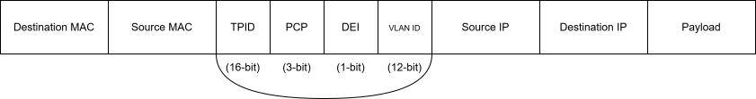

# Ch 1 – Packet Forwarding: Study Notes

**Week:** 1 (May 25–31, 2026)
**Status:** In Progress

---

## Notes for Lab 1 – VLAN Trunking

### VLANs and 802.1Q Trunking

### 802.1Q Frame Fields



| Field | Size | Purpose |
|-------|------|---------|
| TPID | 16 bits | Identify the packet as 802.1Q packet |
| PCP | 3 bits | Indicates a class of service (CoS) |
| DEI | 1 bit | Indicates if a packet can be dropped in the event of bandwidth contention |
| VLAN ID | 12 bits | Specifies the VLAN associated with a network packet |

**Tag Protocol Identifier (TPID):** a 16-bit field, set to 0x8100 to identify the packet as an 802.1Q packet.

**Priority Code Point (PCP):** a 3-bit field indicates a class of service (CoS) as part of Layer 2 quality of service (QoS) between switches.

**Drop Eligible Indicator (DEI):** a 1-bit field indicates whether the packet can be dropped when there is bandwidth contention. Contention is the root cause of network slowdowns, delays, and collisions.

**VLAN Identifier (VLAN ID):** a 12-bit field specifies the VLAN associated with a network packet.

### CAM Table and MAC Learning

**Content Addressable Memory Table (CAM Table)** uses high-speed memory that is faster than typical computer RAM. CAM is a special memory type that is searched by content rather than by address. Given a MAC address as input, the hardware searches the entire table in a single clock cycle and returns the matching port/VLAN entry — much faster than sequential RAM lookups.

**MAC Learning:** switches learn MAC addresses when a frame arrives at an interface by examining the ***source MAC address*** of traffic received. If a switch does not receive a frame with a previously learned source MAC address, it discards that MAC address table entry (by default after 300 seconds).

- The aging timer starts for each learned source MAC address. When a new frame arrives with the same source MAC address, the timer resets to 300 seconds (timer decrements in descending order).

- MAC addresses can be statically assigned to a switch interface to eliminate MAC address spoofing and other security concerns.

- MAC address tables are useful tools to diagnose a Layer 2 issue — locating the source and destination device or switchport.

### Layer 2 Forwarding Process

Two devices on a single network segment (broadcast domain) can forward traffic to each other. However, before traffic can be sent via a network switch, Host A needs to discover the path to Host B.

- Layer 2 forwarding starts with Host A sending a broadcast ARP message using its source MAC address and the broadcast destination MAC address (FF:FF:FF:FF:FF:FF), asking "who has this IP address?"

- The switch receives the frame from Host A and builds its MAC address table by recording Host A's source MAC address, the receiving port number, and the VLAN ID of that switchport.

- The switch performs a MAC address lookup based on the frame's destination MAC address. Since ARP uses a broadcast destination, the switch floods the frame to all switchports in the same broadcast domain except the port it was received on.

- All active hosts receive the frame. Hosts whose IP address does not match the ARP target discard it. Host B, whose IP address matches, sends a unicast frame back to the switch with its own source MAC address and Host A's MAC address as the destination.

- The switch receives the unicast reply and records Host B's source MAC address in the MAC address table along with the receiving port number and VLAN ID.

- The switch forwards the frame to the port where Host A's MAC address was learned.

- Host A receives the frame from Host B.

This completes the Layer 2 forwarding process between two hosts on the same broadcast domain.

### Key Commands

```
! VLAN and trunk verification

show vlan
show vlan br
show vlan 10
show vlan sales

! Layer 2 diagnostic

show mac address-table
show mac address-table interface gig0/1
show mac address-table address AAAA.AAAA.AAAA
show mac address-table | i AAAA
!
show arp
show arp | i 192.168.1.1
```

---

## Notes for Lab 2 – L3 Interfaces

### SVIs, Subinterfaces, and Routed Ports

| Interface Type | When to Use | Key Command |
|---------------|-------------|-------------|
| SVI | | `interface VlanX` |
| Subinterface | | `encapsulation dot1Q` |
| Routed port | | `no switchport` |

### IPv4 and IPv6 Addressing

### Key Commands

```
! Layer 3 verification


```

---

## Notes for Lab 3 – Forwarding Architectures

### CEF and Forwarding Architectures

| Concept | Notes |
|---------|-------|
| Process switching | |
| Software CEF | |
| Hardware CEF | |
| FIB | |
| RIB | |
| Adjacency table | |
| TCAM | |
| SDM templates | |
| Centralized forwarding | |
| Distributed forwarding | |

### Key Commands

```
! CEF and forwarding


! SDM templates


```

---

## Chapter Review

### Things That Tripped Me Up

### Open Questions

### Weekly Mock Test Score

**Score:** &nbsp; / 20
**Weak areas:**
